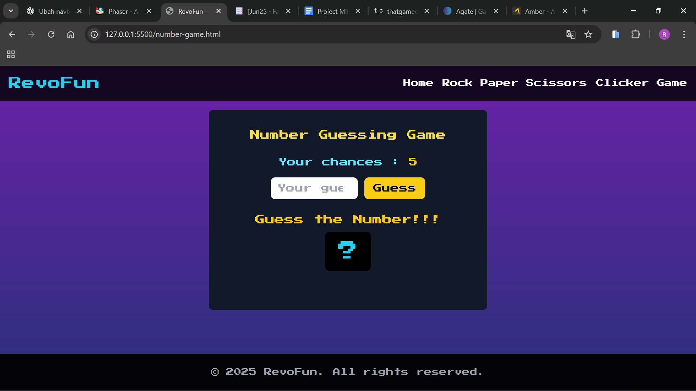

# RevoFun Landing Page

## Overview

This is a **portofolio website** for a game company to showcase their games.

RevoFun have developed 5 games such as:

1. **Clicker Game**
   
2. **Memory Card Game**
   
3. **Number Game**
   
4. **Rock Paper Scissors**
   

5. **Stars Shooter**
   

## Features Implemented

- **Navigation:** Navigate through the web.

- **Guess Number Game:** Trying guess a number between 1 and 100. You had 5 chances

- **Rock Paper Scissors:** Pick between rock, paper and scissors against computer

- **Clicker Game:** Click your mouse as fast as possible between 10 seconds

- **Memory Card Game:** Flips cards to find match pairs

- **Stars Shooter:** Controll the plane to shoot and avoid meteorites and alien space ships

## Technologies Used

- **HTML5** — page structure and semantic markup.
- **CSS** — responsive styling and readability.
- **Javascript** — responsive nav, responsive in project section, image slider in project sesction and manage 3d objects
- **Tools & Platforms:**
  - [GitHub](https://github.com/) for version control and repository management.

## Accessing the Deployed Page

Visit the deployed website at:  
➡️ **[https://revou-fsse-jun25.github.io/milestone-2-Rizaldi87/](https://revou-fsse-jun25.github.io/milestone-2-Rizaldi87/)**

### How to Use the Website

1. Use navigation menu at top to move between game sections.
2. Play the games

---
